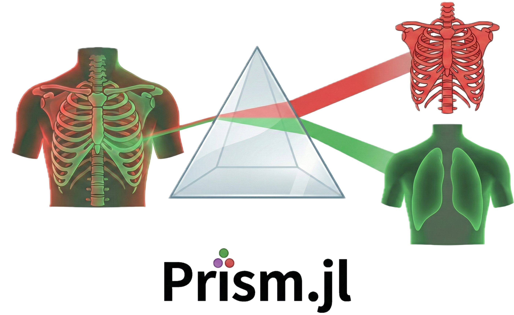

# PrismMaterialDecomposition.jl

<p align="center">
  
</p>

PrismMaterialDecomposition.jl is a Julia package for regularized material decomposition of planar dual-energy kV data, with an emphasis on edge-preserving noise-reduction and GPU-based real-time performance. It provides local and non-local regularization models, along with pre- and post-decomposition utilities for image quality analysis and visualization.

## Overview

PrismMaterialDecomposition.jl supports the full workflow for dual-energy projection studies:

- loading projection data and spectra
- computing linear attenuation coeeficients for materials of interest
- performing unregularized or regularized material decomposition
- benchmarking CPU and GPU regularization strategies
- analyzing image noise, contrast, and spatial resolution

The package currently includes:

- local quadratic and edge-weighted quadratic regularization
- non-local similarity and a new cross-similarity regularization
- matrix-based and matrix-free formulations
- CUDA and Metal backends for supported hardware
- ESF, LSF, FWHM, SNR, CNR, and contrast statistics utilities

## Mathematical Formulation

PrismMaterialDecomposition.jl formulates regularized material decomposition as a convex optimization problem:

$$
\min_{\vec{x}}\ F\left( \vec{x} \right) = \left( \mathbf{A}\vec{x} - \vec{p} \right)^{T}\mathbf{V}^{-1}\left( \mathbf{A}\vec{x} - \vec{p} \right) + \lambda R\left( \vec{x} \right)
$$

where $\vec{x}$ is the vector of material images to be estimated, $\mathbf{A}$ is the system matrix encoding the linear relationship between material images and projection data, $\vec{p}$ is the vector of observed dual-energy projection data, $\mathbf{V}$ is the variance-covariance matrix of the noise in the projection data, $\lambda$ is a regularization parameter controlling the strength of the regularization term, and $R$ is a regularization function that imposes prior knowledge or constraints on the solution.

Two classes of regularization strategies are currently implemented in PrismMaterialDecomposition.jl:
1. Local regularization, which includes quadratic and edge-weighted quadratic regularization. These methods penalize the differences between neighboring pixels in the material images, with the edge-weighted version allowing for edge preservation by reducing the penalty at locations with high gradients.
2. Non-local regularization, which includes similarity and a new cross-similarity regularization. These methods leverage the self-similarity of image patches across the material images to reduce noise while preserving fine details. The cross-similarity regularization is a novel approach specifically designed for dual-energy images. 

## Implementation Details

To solve this linear problem, we used [LinearSolve.jl](https://docs.sciml.ai/LinearSolve/stable/) (and [Krylov.jl](https://github.com/JuliaSmoothOptimizers/Krylov.jl) under the hood) and [SciMLOperators.jl](https://docs.sciml.ai/SciMLOperators/stable/) packages.
The linear material decomposition API is based on the `RegularizedDecompositionProblem` structure, which can be constructed following the CPU or GPU backends:

```julia
RegularizedDecompositionProblemCPU(dli_images::DLI, μ₁::μ, μ₂::μ, λ::Float64, background_mask, reg::Regularization) #for CPU backend

RegularizedDecompositionProblemCUDA(dli_images::DLI, μ₁::μ, μ₂::μ, λ::Float64, background_mask, reg::Regularization) #for Nvidia GPU backend

RegularizedDecompositionProblemMetal(dli_images::DLI, μ₁::μ, μ₂::μ, λ::Float64, background_mask, reg::Regularization) #for Apple GPU backend
```
Where:
- `dli_images::DLI`: The preprocessed DLI images to be decomposed, with the custom type `DLI` that contains the top and bottom layer 2D images.
- `μ₁::μ`: The mass attenuation coefficient for the first material, with the custom type `μ` that contains the high and low energy values.
- `μ₂::μ`: The mass attenuation coefficient for the second material, with the custom type `μ` that contains the high and low energy values.
- `λ::Float64`: The regularization strength.
- `background_mask`: A background mask to compute the variance-covariance matrix.
- `reg::Regularization`: A Regularization object, with the following fields:
  - `name`: The name of the regularization strategy.
  - `constructor`: The constructor function for the regularization as a SciMLOperator (a MatrixOperator, FunctionOperator or ComposedOperator). The constructors are defined in the file regularization_constructors.jl.
  - `params`: The parameters for the regularization strategy, which are passed to the constructor function.

Once defined, the problem can be solved using `RegularizedDecomposition` function:
```julia
RegularizedDecomposition(prob::RegularizedDecompositionProblem)
```

## Installation

### 1. Install Julia

The recommended way to install Julia is with Juliaup, the official Julia installer and version manager. Official installation instructions are available at https://julialang.org/install/ and in the Juliaup repository at https://github.com/JuliaLang/juliaup.

### 2. Install PrismMaterialDecomposition.jl

If PrismMaterialDecomposition.jl has already been registered, install it with:

```julia
using Pkg
Pkg.add("PrismMaterialDecomposition")
```

## Quick Start

The example below uses synthetic dual-energy images so it can be run without access to the repository datasets.

```julia
using PrismMaterialDecomposition

# Synthetic dual-energy inputs
base = rand(256, 256)
dli = DLI(base .+ 0.5, base .+ 0.6)

# Two attenuation descriptors for a simple decomposition experiment
μ1 = μ("Water, Liquid", 0.1926, 0.1781)
μ2 = μ("Bone, Cortical (ICRU-44)", 0.5173, 0.4058)

# Unregularized material decomposition
materials = material_decomposition(dli, μ1, μ2)

# Add a quadratic regularizer on CPU
background_mask = rectangle(90, 130, 90, 130)
λ = 1e-2
reg = Regularization("quadratic", ∇R_quad_op, (2.0, 2.0, 10.0))

problem = RegularizedDecompositionProblemCPU(
    dli,
    μ1,
    μ2,
    λ,
    background_mask,
    reg,
)

materials_reg = RegularizedDecomposition(problem)

# Quantitative inspection
noise = image_noise(materials_reg.mat1, background_mask)
println("Estimated background noise in material 1: ", noise)

# Visualization
fig = plot_heatmap(materials_reg)
display(fig)
```

## GPU Backends

PrismMaterialDecomposition includes GPU regularization operators for supported CUDA and Metal devices. A typical CUDA setup follows the same interface as the CPU workflow:

```julia
using PrismMaterialDecomposition

base = rand(256, 256)
dli = DLI(base .+ 0.5, base .+ 0.6)

μ1 = μ("Water, Liquid", 0.1926, 0.1781)
μ2 = μ("Bone, Cortical (ICRU-44)", 0.5173, 0.4058)

background_mask = rectangle(90, 130, 90, 130)
λ = 1e-2

params_sim_cuda = (dli.top, dli.bottom, 0.1, 0.1, 5)
reg_cuda = Regularization(
    "cross_similarity_cuda",
    ∇R_cross_similarity_op_gpu_cuda,
    params_sim_cuda,
)

problem_cuda = RegularizedDecompositionProblemCUDA(
    dli,
    μ1,
    μ2,
    λ,
    background_mask,
    reg_cuda,
)

materials_cuda = RegularizedDecomposition(problem_cuda)
```

On Apple hardware, the corresponding Metal backend is available through `RegularizedDecompositionProblemMetal` and `∇R_cross_similarity_op_gpu_metal`.

## Package Structure

PrismMaterialDecomposition.jl is organized around a few core abstractions:

- `DLI`, `MI`, and `Spectra` for dual-energy inputs, material images, and spectra
- `Regularization` and `RegularizedDecompositionProblem*` for solver setup
- `λTest` and `compute_lambda_for_noise` for regularization sweeps
- `ImageCaracteristics`, `image_noise`, `SNR`, and `CNR` for quality analysis
- plotting utilities for spectra, material maps, heatmaps, and edge-profile diagnostics

## Examples And Notebooks

The repository includes notebooks and scripts for larger experiments, including batch decomposition, regularization studies, and evaluation workflows. See the `Notebook/` directory for project-specific examples and the `test/` directory for minimal working API usage.

## Citation

If you use PrismMaterialDecomposition.jl in academic work, please cite the associated paper when it becomes available online.

Suggested provisional citation text:

> F. de Kermenguy et al., PRISM: an open-source framework for regularized material decomposition on a novel kV dual-layer imager, forthcoming.

Once the article, DOI, or preprint link is public, this section should be updated with the final bibliographic reference.

## Disclaimer

**The PrismMaterialDecomposition package is intended strictly for research purposes and should not be used in a clinical setting.**

## Contributing

Issues and pull requests are welcome. For local development:

```julia
using Pkg
Pkg.activate(".")
Pkg.instantiate()
Pkg.test()
```

## License

PrismMaterialDecomposition.jl is released under the MIT License. See [LICENSE](LICENSE) for details.
